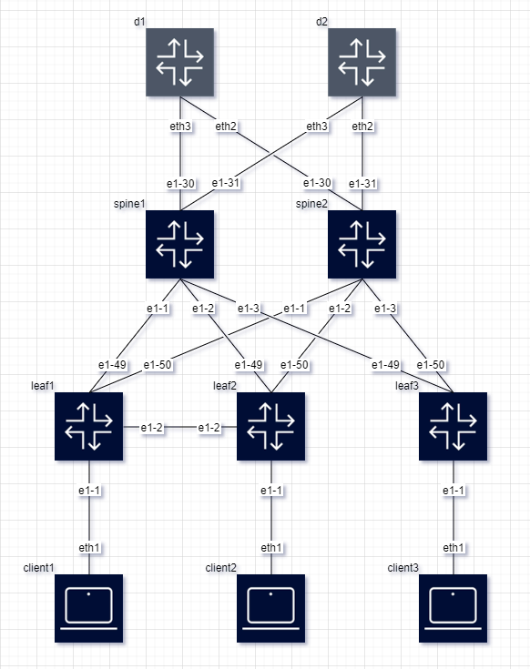

# clab2drawio

`clab2drawio` is a tool designed to automatically generate network topology diagrams from [Containerlab](https://github.com/srl-labs/containerlab) YAML files, rendering them into visually appealing diagrams using Draw.io. This tool simplifies the process of visualizing network designs and configurations, making it easier for network engineers and architects to document and share their containerlab environments.



If you need the opposite, to generate a Containerlab (clab) file from a draw.io drawing, [drawio2clab](https://github.com/FloSch62/drawio2clab) has you covered.

## Features

- **Automatic Diagram Generation**: Converts containerlab YAML configurations into detailed Draw.io diagrams in vertical and horizontal layouts.
- **Intelligent Node Placement**: Attempts to determine the best placement for nodes automatically. However, for complex topologies, this can be challenging.
- **Graph-level-Based Layout**: Organizes nodes into graph-level based on their connectivity for clearer topology visualization. Users can influence node placement by specifying graph-level directly in the containerlab configuration.
- **Graph-icon Support**: Enhances node visualization by allowing users to specify graph-icon labels such as router, switch, or host to define custom icons for nodes in the generated diagrams.
- **Customizable Styles**: Supports customization of node and link styles within the diagrams.

## Running with Docker
To simplify dependency management and execution, clab2drawio can be run inside a Docker container. Follow these instructions to build and run the tool using Docker.

### Pulling from dockerhub
```bash
docker pull flosch62/clab2drawio:latest
```

### Building the Docker Image by yourself

Navigate to the project directory and run:

```bash
docker build -t clab2drawio .
```
This command builds the Docker image of clab2drawio with the tag clab2drawio, using the Dockerfile located in the docker/ directory.

### Running the Tool
Run clab2drawio within a Docker container by mounting the directory containing your .drawio files as a volume. Specify the input and output file paths relative to the mounted volume:
```bash
docker run -v "$(pwd)":/data flosch62/clab2drawio -i data/your_input_file.yaml -o /data/your_output_file.drawio
```
Replace your_input_file.drawio with the name of your actual file. This command mounts your current directory to /data inside the container.


## Installation

Clone the repository to your local machine:

```bash
git clone https://github.com/FloSch62/clab2drawio.git
cd clab2drawio
```

Ensure you have Python 3.x installed on your system. You can then install the required dependencies:
```bash
pip install -r requirements.txt
```

## Usage
To generate a network topology diagram from a containerlab YAML file, run the following command:

```bash
python clab2drawio.py -i <path_to_your_yaml_file> -o <path_to_output_file>
```
The output will be a Draw.io diagram file saved in the output path. You can open this file with Draw.io to view and further edit your network topology diagram.

## Advanced Usage

### Influencing Node Placement

The tool attempts to automatically determine the best placement for nodes. However, achieving an optimal layout for complex topologies might be challenging. You can influence node placement behavior through the `graph-level` and `graph-icon` labels in the containerlab file, which supports both vertical and horizontal layouts. The `graph-level` label impacts the placement of nodes along the primary axis of the chosen layout A lower `graph-level` number (e.g., `graph-level: 1`) indicates a position towards the start of the canvas, while a higher number places the node further along the primary axis. This feature allows you to suggest a specific hierarchy for each node, aiding the tool in organizing the topology more effectively.

Example configuration to set node graph-level:

```bash
client1:
  kind: "linux"
  labels:
    graph-level: 1 # This node will be placed towards the top of the canvas
    graph-icon: host # This node will use the client icon
```
```bash
spine1:
  kind: "linux"
  labels:
    graph-level: 2  # This node will be placed below graph-level 1 nodes on the canvas
    graph-icon: switch # This node will use the switch icon
```
Using graph-level helps manage the vertical alignment of nodes in the generated diagram, making it easier to visualize the hierarchical structure of your network.

### Command-Line Arguments

`clab2drawio` supports several command-line arguments to customize the diagram generation process. Use these arguments to fine-tune the output according to your specific requirements:

- `-i, --input`: Specifies the filename of the input file. This file should be a containerlab YAML for diagram generation. This argument is required.

    ```bash
    python clab2drawio.py -i <path_to_your_yaml_file>
    ```

- `-o, --output`: Specifies the output file path for the generated diagram in draw.io format. This argument is required.

    ```bash
    python clab2drawio.py -i <path_to_your_yaml_file> -o <path_to_output_file>
    ```

- `--include-unlinked-nodes`: Include nodes without any links in the topology diagram. By default, only nodes with at least one connection are included.

- `--no-links`: Do not draw links between nodes in the topology diagram. This option can be useful for focusing on node placement or when the connectivity between nodes is not relevant.

- `--layout`: Specifies the layout of the topology diagram (either `vertical` or `horizontal`). The default layout is `vertical`.

- `--verbose`: Enable verbose output for debugging purposes.


## Customization
The tool allows for basic customization of node and link styles within the generated diagram. To customize, edit the custom_styles dictionary within the clab2drawio.py file according to your preferences.